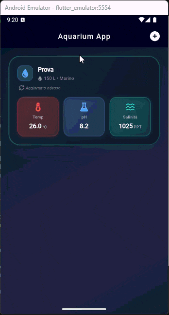
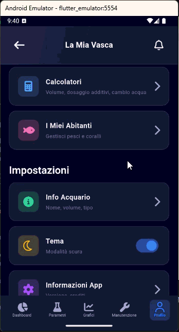

# ReefLife


> **Prerequisite:**  
> This app requires the companion backend [Aquarium Monitor](https://github.com/F3rren/aquarium-monitor) to operate.  
> Without the backend, data persistence, authentication, and most features will not be available.

A cross-platform app for smart aquarium management. Track water parameters, manage tank inhabitants, schedule maintenance tasks, and keep a full activity history over time.




---

## Current Status

- Core features fully operational with complete database persistence.
- IoT sensor integration (Arduino + Raspberry Pi) in progress.
- Full UI with selectable light/dark theme.
- Localized in 5 languages: Italian, English, German, Spanish, French.
- Local notifications active; remote push notifications not yet implemented.

---

## Features

- **Aquarium management** — Create, edit, and delete marine, freshwater, and reef tanks. Default maintenance tasks are automatically initialized based on the tank type.
- **Species database** — Fish and coral catalog with filtering by water type compatibility.
- **Maintenance** — Schedule and track recurring tasks (water change, filter cleaning, dosing, etc.) with persistent history.
- **Water parameters** — View temperature, pH, ORP, and salinity with interactive historical charts (sensor integration in progress).
- **Notifications** — Local alerts when critical parameter thresholds are exceeded.
- **Multilingual** — Fully localized UI; default tasks are translated automatically based on the device language.
- **Theme** — Light and dark mode selectable by the user.

---

## Roadmap

- [ ] Arduino / Raspberry Pi integration for real-time sensor readings
- [ ] User authentication and profile management
- [ ] Remote push notifications for parameter alerts
- [ ] Data export and multi-parameter charts
- [ ] Cloud backup and cross-device sync
- [ ] Species database expansion (community contributions)
- [x] Multilingual support (IT, EN, DE, ES, FR)
- [x] Default maintenance tasks differentiated by tank type
- [x] Light/dark theme

---

## Architecture

| Layer | Technology |
|---|---|
| UI | Flutter 3.x |
| State management | Riverpod |
| HTTP client | `package:http` |
| Token storage | `flutter_secure_storage` (Android Keystore / iOS Keychain) |
| Local notifications | `flutter_local_notifications` |
| Charts | `fl_chart` |
| Icons | Font Awesome Flutter |
| Backend | Java (Spring Boot) on AWS |

---

## Getting Started

### Prerequisites

- Flutter SDK (^3.9.2)
- Dart SDK (^3.9.2)
- [Aquarium Monitor](https://github.com/F3rren/aquarium-monitor) backend running

### Installation

```bash
git clone https://github.com/F3rren/aquarium-interface.git
cd aquarium-interface
flutter pub get
```

### API Configuration

The backend URL is injected at compile-time via `--dart-define`:

```bash
# Development
flutter run --dart-define=API_BASE_URL=http://<IP>:<PORT>

# Android release build
flutter build apk --dart-define=API_BASE_URL=http://<IP>:<PORT>
```

If `API_BASE_URL` is not specified, the default value defined in `lib/services/api_service.dart` is used.

> **Android note:** For plain HTTP connections (non-HTTPS), the IP/domain must be listed in `android/app/src/main/res/xml/network_security_config.xml`.

### Running on a physical device

```bash
flutter devices          # list connected devices
flutter run -d <device>  # launch on the selected device
```

---

## Project Structure

```
lib/
├── l10n/           # ARB localization files (it, en, de, es, fr)
├── models/         # Data models (Aquarium, Fish, MaintenanceTask, ...)
├── providers/      # Riverpod providers
├── services/       # Business logic and API calls
├── utils/          # Helpers (task_localizer, custom_page_route, ...)
└── views/          # Screens and widgets
    ├── aquarium/
    ├── dashboard/
    ├── home/
    ├── maintenance/
    └── profile/
```

---

## License

Distributed under the MIT License. See [LICENSE](LICENSE) for details.
